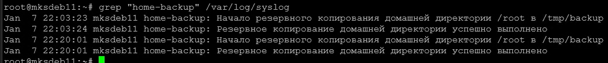
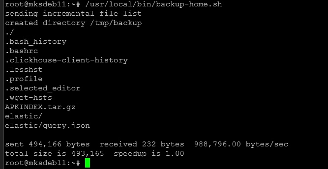

# Домашнее задание к занятию "`Системы мониторинга`" - `Милованов Константин`
[Задание](https://github.com/netology-code/mnt-homeworks/blob/MNT-video/10-monitoring-02-systems/README.md)

### Задание 1

Вас пригласили настроить мониторинг на проект. На онбординге вам рассказали, что проект представляет из себя платформу для вычислений с выдачей текстовых отчетов, которые сохраняются на диск. Взаимодействие с платформой осуществляется по протоколу http. Также вам отметили, что вычисления загружают ЦПУ. Какой минимальный набор метрик вы выведите в мониторинг и почему?

### Решение

1) CPU-метрики (вычисления), поскольку вычисления загружают CPU. Точнее:
* CPU utilization (%) по ядрам/подам/хостам.
* Load Average (1m, 5m, 15m) — показывает, есть ли очередь на выполнение задач.
* CPU throttling (в основном для контейнеров).

2) Метрики диска, поскольку отчеты сохраняются на диск.
* Свободное место на диске - при его отсутствии отчеты не будут сохраняться.
* Disk I/O (очередь к диску, IOPS) - чтобы запись не стала узким местом в процессе.
* Inode usage — бывает проблема при большом количестве мелких файлов.

3) HTTP-метрики (доступность и производительность), поскольку взаимодействие с платформой по HTTP.
* HTTP-коды ответов (2xx / 4xx / 5xx) — критично для понимания, отвечает ли сервис успешно.
* RPS (requests per second) по эндпоинтам — показывает текущую нагрузку на платформу.
* Количество активных соединений — полезно для понимания, не упирается ли сервис в лимиты.

4) Метрики вычислений и отчётов (бизнес-логика). HTTP может быть 200 OK, а вычисление — падать или отчёт не записываться. Эти метрики отражают реальную SLI платформы.
* Количество запущенных / завершённых / упавших вычислений (success/failure rate).
* Latency (p50, p95, p99) времени ответа — средняя задержка может скрывать проблемы; перцентили покажут, как чувствуют себя в т.ч. отдельные запросы или хвосты запросов.
* Ошибки записи на диск (I/O errors, permission denied, disk full) — критично, т.к. отчёты сохраняются на диск.

5) Также полезны метрики такие как:
* Memory usage — вычисления могут потреблять много RAM, утечки приведут к OOM.
* Network I/O — чтобы сеть не стала узким местом.

---

### Задание 2

1. Написать скрипт и настроить задачу на регулярное резервное копирование домашней директории пользователя с помощью rsync и cron.
2. Резервная копия должна быть полностью зеркальной
3. Резервная копия должна создаваться раз в день, в системном логе должна появляться запись об успешном или неуспешном выполнении операции
4. Резервная копия размещается локально, в директории /tmp/backup
5. На проверку направить файл crontab и скриншот с результатом работы утилиты.

### Решение

Файл crontab:

`20 22 * * * /usr/local/bin/backup-home.sh`

Скриншот с записями из лога. В 22:03 тестовый запуск вручную. Затем в 22:20 запуск по расписанию из crontab:

Дополнение:

Скриншот выполнения скрипта:

Скрипт:
[Скрипт](./files/backup-home.sh)
